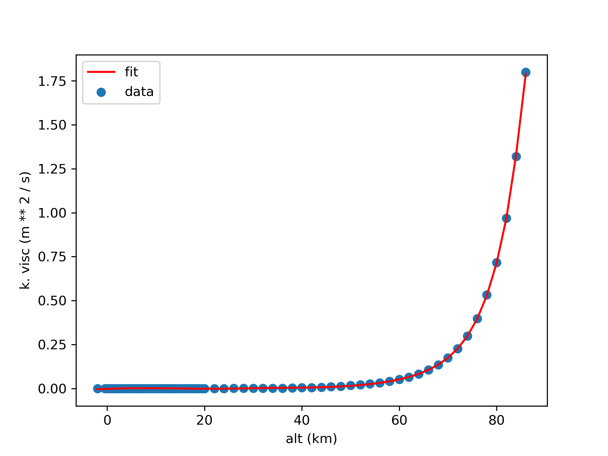
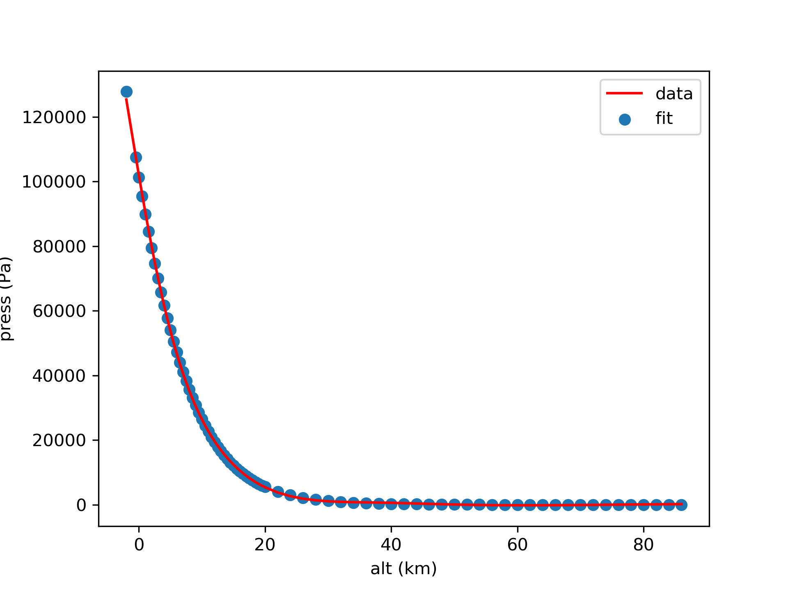
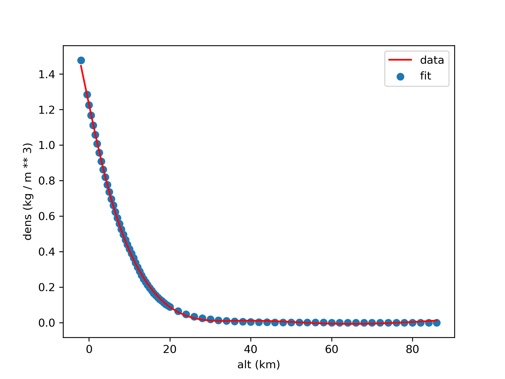
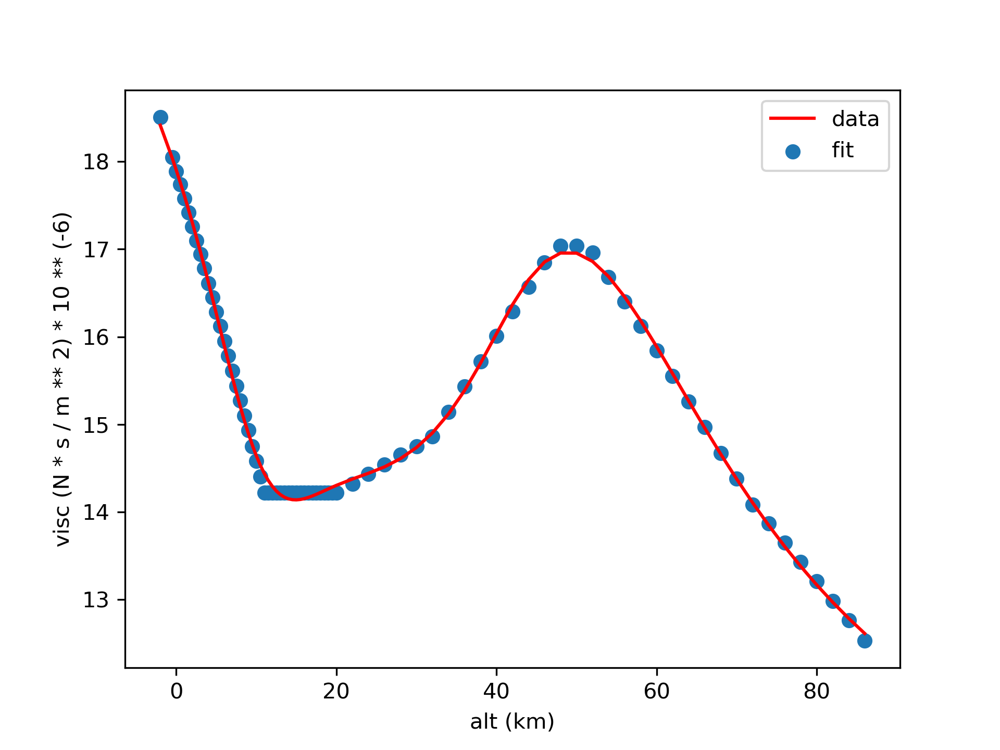
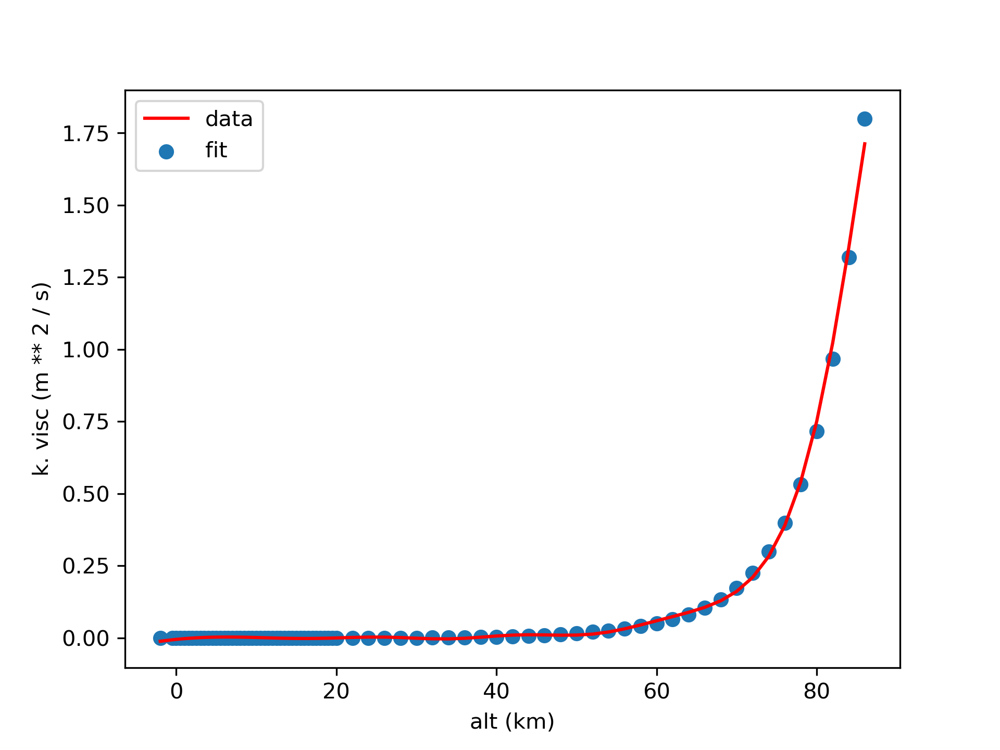
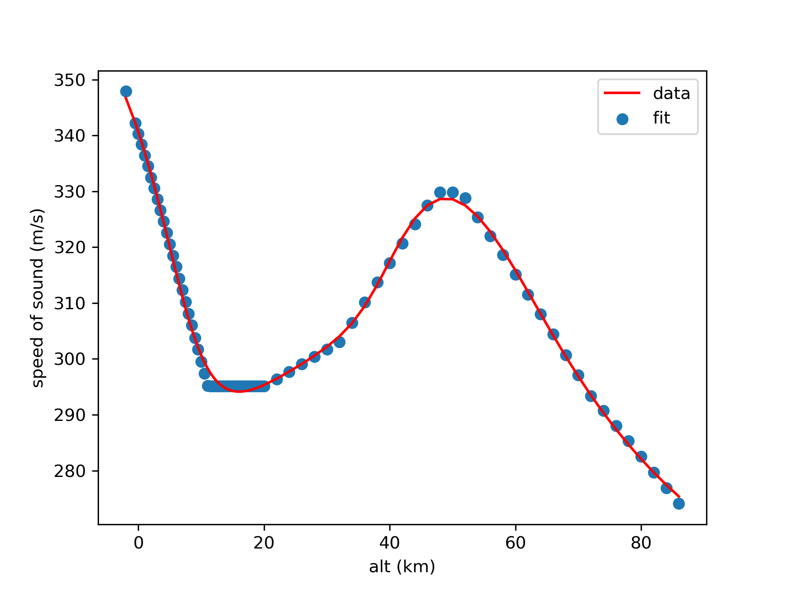

# Differentiable 1976 Atmosphere

This Python library provides a singleton class that 
computes ambient properties for the 1976 standard 
atmosphere model, using data taken from 
http://www.pdas.com/atmos.html (in metric units with altitude 
provided in km). 

The library is vectorized using numpy, such that 
inputting are array of altitudes will return a 
corresponding array of the atmospheric property requested. 
Furthermore, rather than interpolating table values, the 
library uses the 1976 standard atmosphere data to 
train neural networks with the results shown below. 

Discontinuities are not captured, but the approximation 
remains very good, as can be seen. Such accuracy is acceptable 
for aircraft conceptual design, which is the target application 
of this model. The advantage of this approach is it results 
in an analytically differentiable atmosphere model, where 
partials with respect to altitude are defined everywhere. 

This feature is desirable in the context of MDAO, 
because advanced frameworks to solve such problems 
typically rely on gradient-based methods to simultaneously 
optimize inter-dependent components, modeled as individual 
nodes linked together in a graph via inputs and outputs. 

In such a setup, partial derivatives (that don't account for coupling) 
are necessary prerequisite to 
compute total derivatives (which do account for coupling).
The availability of analytical derivatives for all nodes in the 
MDAO graph greatly improves the
efficiency and robustness of MDAO solvers by avoiding 
the need for finite difference, which is notoriously prone 
to error (sensitive to step size) and computationally taxing. 

# Installation 

This library depends only on numpy and genn. Assuming you are 
working with conda: 

    conda activate my_env 
    
Where `my_env` is the name of the conda environment you want to 
work in. Then, install the dependencies: 

    conda install numpy 
    pip install git+https://github.com/shb84/GENN.git#egg=genn

Once the dependencies are satisfied: 

    pip install git+https://github.com/shb84/ATM76.git#egg=atm76

# Usage

_See `example_usage.ipynb` notebook_

    import numpy as np
    from atm76 import ATM76
    
    atm = ATM76() 
    
    # Inputs 
    h = np.arange(0, 80, 5)  # km
    M = 0.8
    
    # Static properties 
    P = atm.pressure(altitude=h)  # Pa
    T = atm.temperature(altitude=h)  # K
    rho = atm.density(altitude=h)  # kg/m^3
    a = atm.speed_of_sound(altitude=h)  # m/s
    mu = atm.viscosity(altitude=h)  # mg / (m * s)
    
    # Stagnation properties 
    Pt = atm.total_pressure(altitude=h, mach_number=M)  # Pa
    Tt = atm.total_temperature(altitude=h, mach_number=M)  # K
    
    # Partials
    dP_dh = atm.grad_pressure(altitude=h)
    dT_dh = atm.grad_temperature(altitude=h)
    drho_dh = atm.grad_density(altitude=h)
    da_dh = atm.grad_speed_of_sound(altitude=h)
    dmu_dh = atm.grad_viscosity(altitude=h)
    
    dPt_dh = atm.grad_total_pressure(altitude=h, mach_number=M)[0]
    dPt_dM = atm.grad_total_pressure(altitude=h, mach_number=M)[1]
    
    dTt_dh = atm.grad_total_temperature(altitude=h, mach_number=M)[0]
    dTt_dM = atm.grad_total_temperature(altitude=h, mach_number=M)[1]

# Prediction Accuracy

### Temperature 

### Pressure 

### Density 

### Viscosity 

### Kinematic Viscosity 

### Speed of Sound

